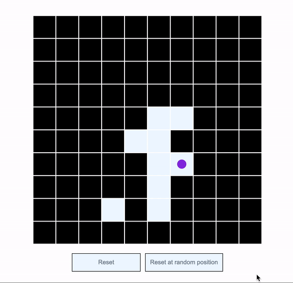

# Ant Movement Tracker

### About
Ant movement tracker is a program that models the movement of an ant in a grid.
The movement is tracked by the toggling nature of the tiles in the grid signifying the ants touched tile(position).

- A purple circle is used to denote the ant.
- The ant is placed in a 10 * 10 grid(100 tiles).
- The ant has a default placement at tile 46.
- The tile color changes when the ant has touched a tile and has moved on to a new position.

### Preview

## How to start up project
- Clone the repository
- open up `index.html` file in the browser

### How to run application unit test
- clone the repository
- run the following code in the terminal
    - npm install (To install the dependencies(jest, eslint))
    - npm run test (to run unit test contained in the test file).
    
### CI workflow

Github actions was used to manage the continuous integration process.
Deployment is on heroku, the deployment listens for changes to the **master** branch as well as successful running of the CI workflow before a new deployment is automatically initiated.

##### The flow

- The process listens to push/merge request to the master branch
- A runner is created on an ubuntu server
- A version of the application is checked out to the server to be ran in isolation
- A node environment is established on the server
- The development dependencies are installed (npm install)
- The test script is ran (npm run test)
- On successful running of the CI process, a deployment on heroku is triggered.

### Extra
- Unit test - Jest Library
- Linting - ESlint
